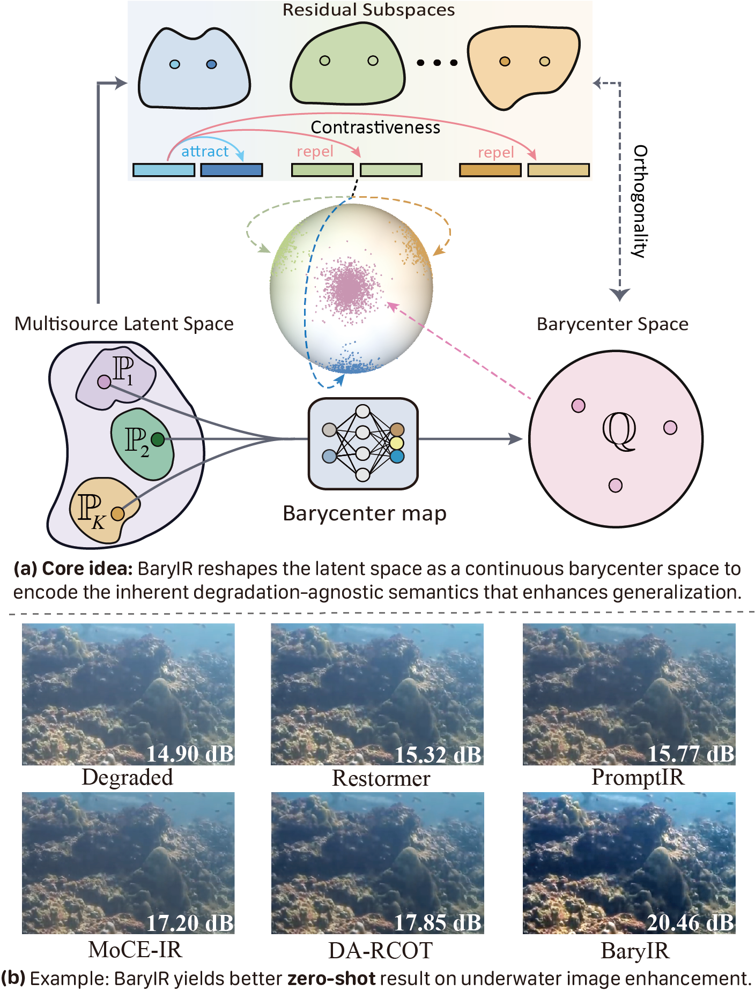
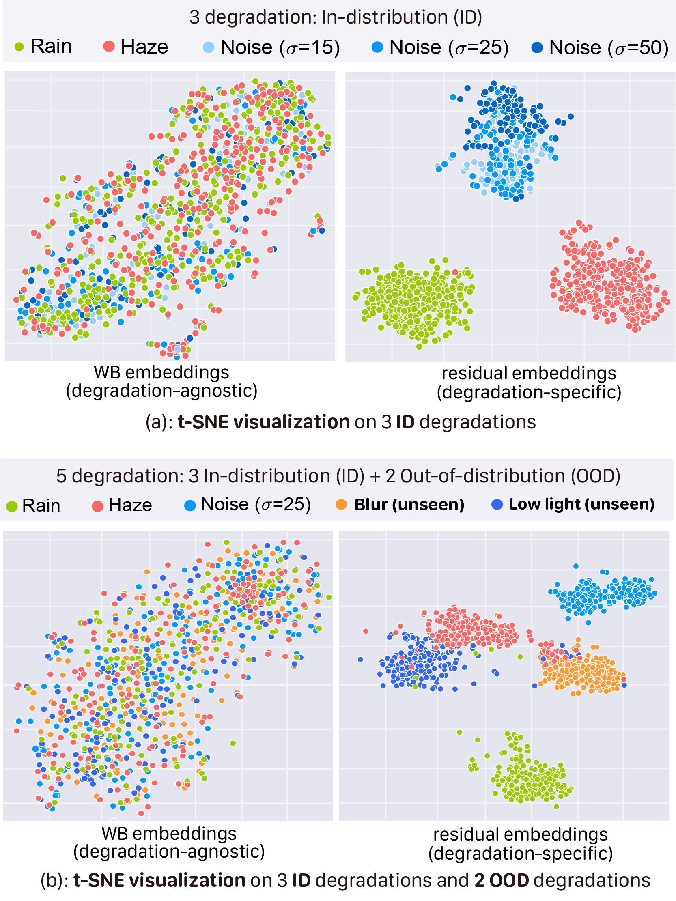
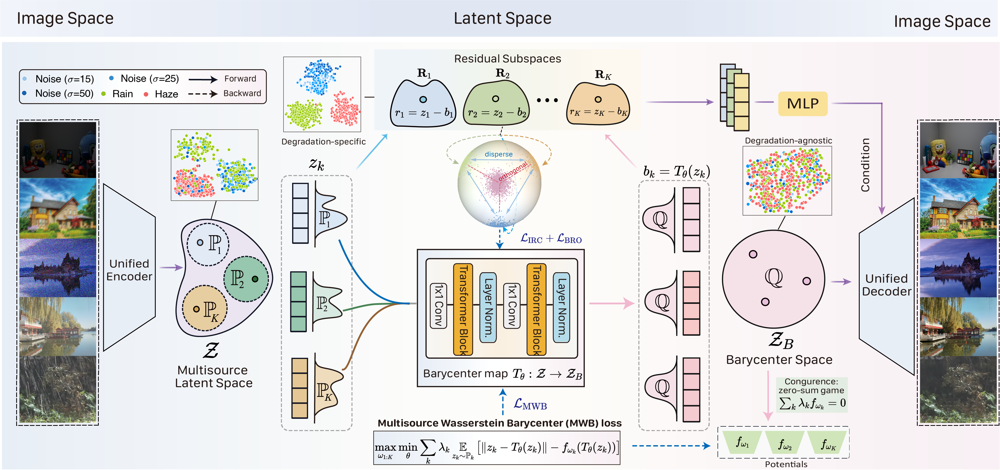
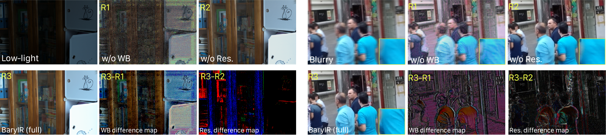
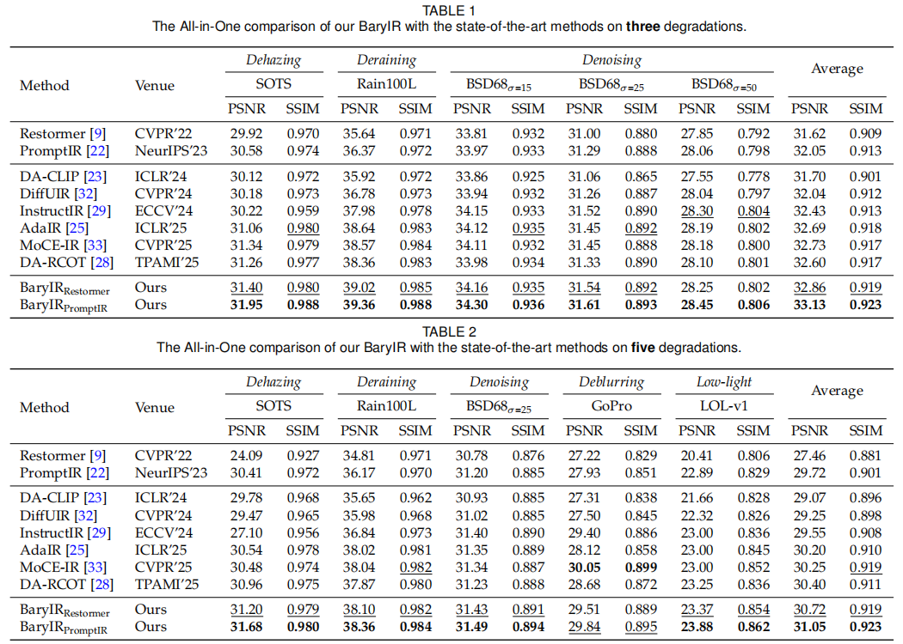
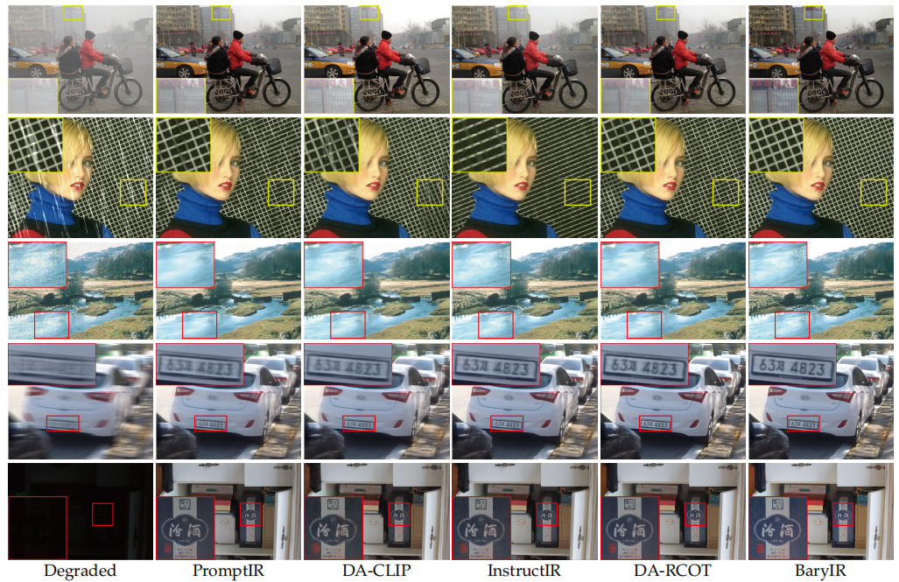

# (TPAMI 2026) Learning Continuous Wasserstein Barycenter Space for Generalized All-in-One Image Restoration

## Updates
- [x] We released the codes for 3D/5D all-in-one training and evaluation.
- [x] 🎉🎉🎉 Our BaryIR paper was accepted by TPAMI 2026 🎉🎉🎉
- [ ] Upload pretrained models and other training scripts

[](https://arxiv.org/pdf/2602.23169)

<hr />

> **Abstract:** *Despite substantial advances in all-in-one image restoration for addressing diverse degradations within a unified model, existing methods remain vulnerable to out-of-distribution degradations, thereby limiting their generalization in real-world scenarios. To tackle the challenge, this work is motivated by the intuition that multisource degraded feature distributions are induced by different degradation-specific shifts from an underlying degradation-agnostic distribution, and recovering such a shared distribution is thus crucial for achieving generalization across degradations. With this insight, we propose BaryIR, a representation learning framework that aligns multisource degraded features in the Wasserstein barycenter (WB) space, which models a degradation-agnostic distribution by minimizing the average of Wasserstein distances to multisource degraded distributions. We further introduce residual subspaces, whose embeddings are mutually contrasted while remaining orthogonal to the WB embeddings. Consequently, BaryIR explicitly decouples two orthogonal spaces: a WB space that encodes the degradation-agnostic invariant contents shared across degradations, and residual subspaces that adaptively preserve the degradation-specific knowledge. This disentanglement mitigates overfitting to in-distribution degradations and enables adaptive restoration grounded on the degradation-agnostic shared invariance. Extensive experiments demonstrate that BaryIR performs competitively against state-of-the-art all-in-one methods. Notably, BaryIR generalizes well to unseen degradations (e.g., types and levels) and shows remarkable robustness in learning generalized features, even when trained on limited degradation types and evaluated on real-world data with mixed degradations.* 
<hr />


## Main Figs
 

 

#### Takeaway: Role of WB and residual at image level
 
The WB difference maps (R3-R1) primarily capture common image structures and contents. Conversely, the residual difference maps (R3-R2) are spatially-adaptive, concentrating on the degradation-specific pixels that are heavily affected by degradations.


##  Setup
This repository is built in PyTorch 2.1.1 and tested on an Ubuntu 18.04 environment (Python3.8, CUDA11.8). 
###  Dependencies Installation


1. Clone our repository
```
git clone https://github.com/xl-tang3/BaryIR.git
cd BaryIR
```

2. Create conda environment
The Conda environment used can be recreated using the env.yml file
```
conda env create -f env.yml
```

or


```
conda create -n BaryIR python=3.8
conda activate BaryIR
pip install torch==2.1.1 torchvision==0.16.1 torchaudio==2.1.1
pip install scikit-image
pip install einops
pip install h5py
pip install opencv-python
pip install tqdm
pip install lpips
pip install matplotlib
```

###  Dataset Download and Preperation

All the datasets used in the paper can be downloaded from the following locations:

Denoising: [BSD400](https://drive.google.com/file/d/1idKFDkAHJGAFDn1OyXZxsTbOSBx9GS8N/view?usp=sharing), [WED](https://drive.google.com/file/d/19_mCE_GXfmE5yYsm-HEzuZQqmwMjPpJr/view?usp=sharing), [Kodak24]([https://drive.google.com/drive/folders/1B3DJGQKB6eNdwuQIhdskA64qUuVKLZ9u](https://www.kaggle.com/datasets/drxinchengzhu/kodak24/data)), [BSD68](https://github.com/cszn/DnCNN/tree/master/testsets)  

Deraining: [Train100L&Rain100L](https://drive.google.com/drive/folders/1-_Tw-LHJF4vh8fpogKgZx1EQ9MhsJI_f?usp=sharing)

Dehazing: [RESIDE](https://sites.google.com/view/reside-dehaze-datasets/reside-v0) (SOTS)

Deblurring: [GoPro](https://seungjunnah.github.io/Datasets/gopro.html) 

Low-light enhancement: [LOLv1](https://github.com/caiyuanhao1998/Retinexformer) 


The training data should be placed in ``` data/Train/{task_name}``` directory where ```task_name``` can be Denoise, Derain, Dehaze or any single degradation.
After placing the training data the directory structure would be as follows:
```
└───Train
    ├───Dehaze
    │   ├───original
    │   └───synthetic
    ├───Denoise
    └───Derain
        ├───gt
        └───rainy
    └───Deblur
        ├───blur
        ├───sharp
    └───low_light
        ├───high
        ├───low
    └───single
    │   ├───degraded
    │   └───target
```

The testing data should be placed in the ```test``` directory wherein each task has a separate directory. The test directory after setup:

```
└───Test
    ├───dehaze
    │   ├───input
    │   └───target
    ├───denoise
    │   ├───bsd68
    │   └───kodak24
    ├───deblur
    │   ├───input
    │   └───target
    ├───lowlight
    │   ├───low
    │   └───high
    └───derain
    │   └───Rain100L
    │        ├───input
    │        └───target
```

## Inference
```
python tester_bary.py
```
> [!NOTE]
> **Efficiency Note:** While BaryIR offers efficient inference, training is computationally intensive given the large-scale mixed datasets involved. Please **configure your data paths and parameters** according to your specific tasks and hardware availability.

## Training

For example, the cmds for non-DDP and  DDP training BaryIR are as follows:

### Non-DDP
#### 3D
```
python trainer_bary.py --batchSize=3 --nEpochs=57 --pairnum=10000000 --Sigma=10000 --sigma=1 --de_type derain dehaze denoise_15 denoise_25 denoise_50 --patch_size=128 --type all --gpus=0 --backbone=BaryNet --step=50 --resume=checkpoint/model_allBaryNet128__56_1.0.pt --num_source=3
```
#### 5D
```
python trainer_bary.py --batchSize=3 --nEpochs=57 --pairnum=10000000 --Sigma=10000 --sigma=1 --de_type derain dehaze lowlight denoise_25 deblur --patch_size=128 --type all --gpus=0 --backbone=BaryNet --step=31 --resume=checkpoint/model_allBaryNet128__57_1.0.pt --num_source=5
```
### DDP (5D as an example)
```
CUDA_VISIBLE_DEVICES=0,1,2 torchrun \
  --nproc_per_node=3 \
  --master_port=9833 \
  trainer_bary_ddp.py \
  --batchSize=3 \
  --nEpochs=65 \
  --pairnum=10000000 \
  --Sigma=10000 \
  --sigma=1 \
  --de_type derain dehaze deblur denoise_25 lowlight \
  --patch_size=144 \
  --type all \
  --backbone=BaryNet \
  --step=35 \
  --resume=checkpoint/model_allBaryNet128__58_1.0.pt \
  --num_sources=5
```
### Results

Performance results of the BaryIR framework trained under the all-in-one setting.

<details>
<summary><strong>3D and 5D Comparison</strong> (click to expand) </summary>

 
</details>

#### 5D visual examples
 

## Citation
```
@article{tang2026learning,
  author={Tang, Xiaole and Gu, Xiang and He, Xiaoyi and Hu, Xin and Sun, Jian},
  journal={IEEE Transactions on Pattern Analysis and Machine Intelligence}, 
  title={Learning Continuous Wasserstein Barycenter Space for Generalized All-in-One Image Restoration}, 
  year={2026}}

```
